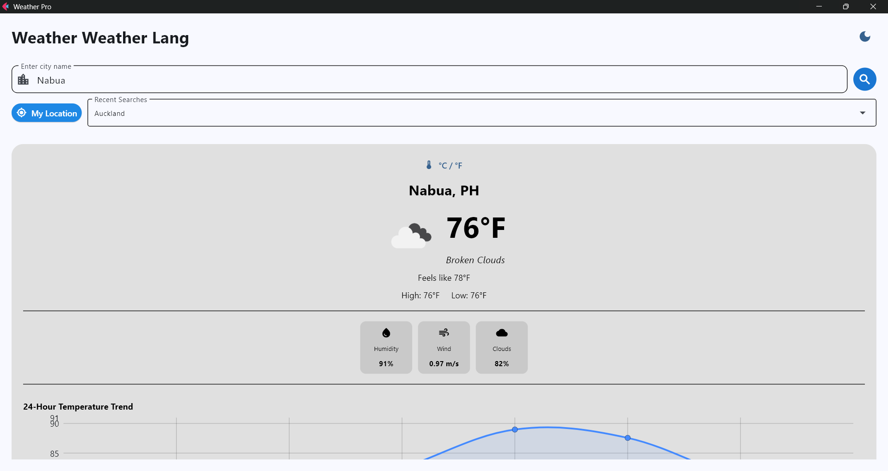
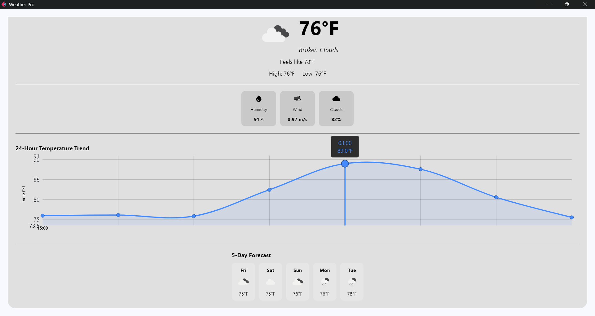
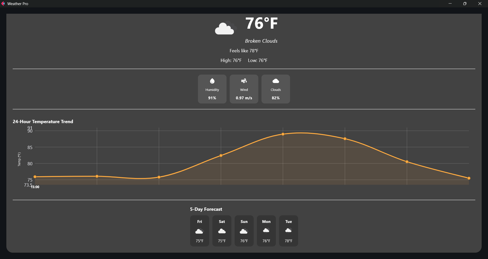

# 🌤️ Flet Weather Application  
**Module 6 – Python Flet Project**

## 👤 Student Information  
**Name:** Sean Xander B. Aquino  
**Course / Section:** BSCS 3A  
**Subject:** CCCS 106  

---

A **modern, cross-platform Weather Application** built with **Python + Flet**, featuring real-time weather data, dynamic UI themes, geolocation support, and Material Design components. The app runs seamlessly on **desktop, mobile, and web** using a single codebase.

---

## ✨ Features

### 🌡️ Real-Time Weather  
- Fetches up-to-date **temperature**, **humidity**, **wind speed**, and conditions using the **OpenWeatherMap API**.

### 🎨 Dynamic Backgrounds  
- UI colors and gradients adapt to current weather:
  - **Indigo** → Clear night  
  - **Grey** → Cloudy  
  - **Orange** → Sunrise / Sunset  
  - **Blue** → Clear daytime  

### 📍 Geolocation  
- Automatically detects device location at startup for instant local weather display.

### 🔍 City Search  
- Search any city worldwide with validation and clear error handling.

### 🔄 Unit Conversion  
- Toggle between **Metric (°C)** and **Imperial (°F)** units.

### 🌙 Theme Support  
- Full **Dark/Light Mode** with automatic system theme detection.

### 🕗 Search History  
- Stores your **last 5 searched locations** using Flet’s `client_storage`.

---

## 🧰 Tech Stack

| Component | Technology |
|----------|------------|
| Language | Python 3.x |
| Framework | Flet (Flutter for Python) |
| API | OpenWeatherMap |
| UI Assets | Material Icons |

---

## 📸 Screenshots

Below are screenshots of the Flet Weather Application (stored in the `ss/` folder).

*Home screen showing current weather and search.*

*Search results and details view and switching to other measurement (farenheit)*

*Trend and unit settings.*

*Dark Theme*